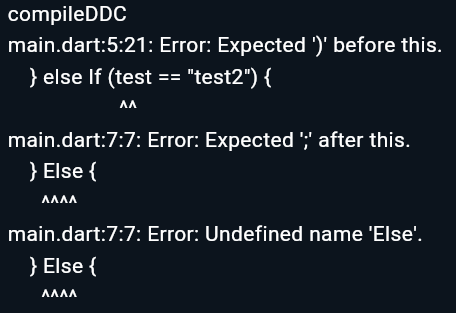
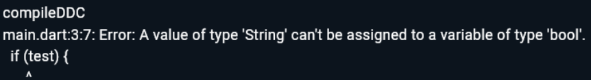
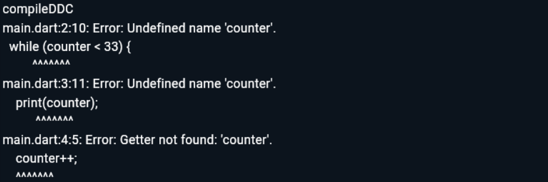
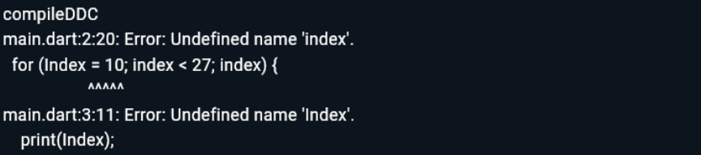
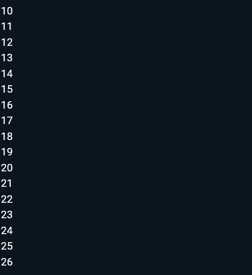
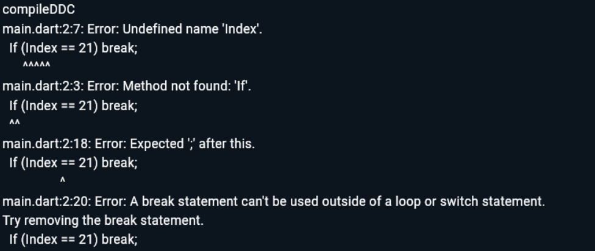
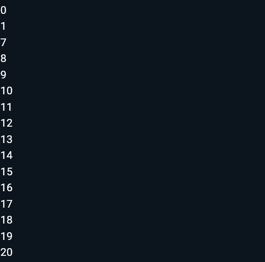
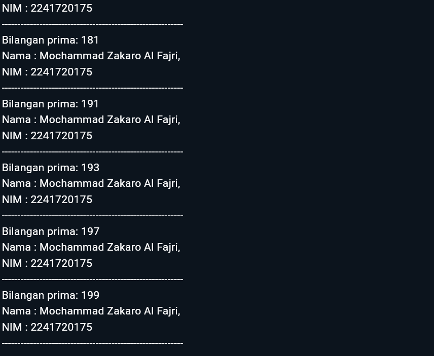

# *Pertemuan 03 | Pengantar Bahasa Pemrograman Dart*

**Nama** : Mochammad Zakaro Al Fajri

**NIM** : 2241720175

**Kelas** : TI-3F

**No Absen** : 14

## Praktikum 1 | Menerapkan Control Flows ("if/else")
**LANGKAH 1**
```dart
void main() {
    String test = "test2";
    if (test == "test1") {
        print("Test1");
    } else If (test == "test2") {
        print("Test2");
    } Else {
        print("Something else");
    }

    if (test == "test2") print("Test2 again");
}
```
### Silakan coba eksekusi (Run) kode pada langkah 1 tersebut. Apa yang terjadi? Jelaskan!

Output:



Jawab : Yang terjadi adalah muncul pesan error yang disebabkan karena terdapat penulisan huruf kapital yang tidak sesuai pada else if dan else. Pada Dart, keyword if, else if, dan else semuanya harus menggunakan huruf kecil

**LANGKAH 2**

```dart
String test = "true";
if (test) {
   print("Kebenaran");
}
```

### Apa yang terjadi ? Jika terjadi error, silakan perbaiki namun tetap menggunakan if/else.

Output : 



Jawab : Terjadai error yang disebabkan oleh penggunaan tipe data string pada kondisi if. Pada dart, kondisi if harus berupa nilai boolean atau true/false. 

Perbaikan : 

```dart
void main() {
  String test = "true";
  
  if (test == "true") {
    print("Kebenaran");
  }
}

```

Output perbaikan : 


## Praktikum 2 | Menerapkan Perulangan "while" dan "do-while"

**LANGKAH 1**

```dart
while (counter < 33) {
  print(counter);
  counter++;
}
```

### Silakan coba eksekusi (Run) kode pada langkah 1 tersebut. Apa yang terjadi? Jelaskan! Lalu perbaiki jika terjadi error.

Output : 



Jawab : Terdapat error yang disebabkan karena belum diinisialisasi nya variable counter sebalum dipakai dalam kondisi while. Sebelum digunakan pada sebuah kondisi/pernyataan, variable harus diinisialisasi terlebih dahulu dengan tipe data

Perbaikan 

```dart
void main(){
    int counter = 1;
    while (counter < 33) {
      print(counter);
      counter++;
    }
}
```

Output : 


**Langkah 2**

```dart
void main(){
    int counter = 1; 
    do {
      print(counter);
      counter++;
    } while (counter < 77);
}
```

Output : 


Jawab : Kode pada langkah ini berhasil dan memiliki dengan menggunakan loop do-while. Output berupa mencetak angka mulai dari 1 hingga 76.

## Praktikum 3 | Menerapkan Perulangan "for" dan "break-continue"

**LANGKAH 1**

```dart
for (Index = 10; index < 27; index) {
  print(Index);
}
```

### Silakan coba eksekusi (Run) kode pada langkah 1 tersebut. Apa yang terjadi? Jelaskan! Lalu perbaiki jika terjadi error.

Output : 



Jawab : Terjadi error yang disebabkan oleh beberapa faktor, diantaranya 
- variable index tidak diinisialisi dengan baik
- penulisan nama variable "index" yang tidak konsisten, ada yang menggunakan huruf besar dan ada yang menggunakan huruf kecil
- Tidak adanya increment pada for loop yang menyebabkan loop tidak akan pernah berhenti 

Perbaikan : 

```dart
void main(){
    for (int index = 10; index < 27; index++) {
      print(index);
    }
}
```

Output : 



**LANGKAH 2**

```dart
If (Index == 21) break;
Else If (index > 1 || index < 7) continue;
print(index);
```

### Apa yang terjadi? Jika terjadi error, silakan perbaiki namun tetap menggunakan for dan break-continue

Output : 



Jawab : Terdapat error yang disebabkan oleh beberapa faktor, antara lain : 
- Penggunaan huruf kapital pada "If" dan "Else IF" yang seharusnya "if", "else if"
- Penggunaan kondisi pada else if yaitu index > 1 || index < 7, yang akan selalu benar.
- Tidak diinisialisasikannya variabel index

Perbaikan : 
```dart
void main() {
  for (int index = 0; index < 30; index++) {
    if (index == 21) {
      break;
    } else if (index > 1 && index < 7) {
      continue;
    }
    print(index);
  }
}
```

Output perbaikan : 



## Tugas Praktikum

### Buatlah sebuah program yang dapat menampilkan bilangan prima dari angka 0 sampai 201 menggunakan Dart. Ketika bilangan prima ditemukan, maka tampilkan nama lengkap dan NIM Anda

Kode : 

```dart
void main() {
  String namaLengkap = "Mochammad Zakaro Al Fajri";
  String nim = "2241720175";

  print(
      "Bilangan prima dari 0 hingga 201:\n----------------------------------------------------------");

  for (int x = 2; x <= 201; x++) {
    bool isPrime = true;

    for (int y = 2; y <= x / 2; y++) {
      if (x % y == 0) {
        isPrime = false;
        break;
      }
    }

    if (isPrime) {
      print("Bilangan prima: $x");
      print("Nama : $namaLengkap,\nNIM : $nim");
      print("----------------------------------------------------------");
    }
  }
}
```

Output : 




