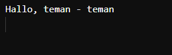

# *Pertemuan 4 - Pengantar Bahasa Pemrograman Dart*

**Nama** : Mochammad Zakaro Al Fajri

**NIM** : 2241720175

**Kelas** : TI-3F

**No Absen ** : 14

## Praktikum 1 (Eksperimen Tipe Data List)

**Langkah 1**:
```dart
var list = [1, 2, 3];
assert(list.length == 3);
assert(list[1] == 2);
print(list.length);
print(list[1]);

list[1] = 1;
assert(list[1] == 1);
print(list[1]);
```

**Langkah 2**:

Silakan coba eksekusi (Run) kode pada langkah 1 tersebut. Apa yang terjadi? Jelaskan!


**Jawab** : Kode tersebut mencetak angka 3 2 1 dengan posisi menurun. Pertama, kode tersebut mendeklarasikan  list dengan tiga elemen [1, 2, 3] kemudian menggunakan beberapa pernyataan assert melakukan verifikasi apakah panjang list adalah 3 dan elemen kedua adalah 2. Jika benar, kode selanjutnya dijalankan melakukan pencetakan nilai panjang dari list yaitu 3 dan nilai index 1 yaitu 2. Jika salah akan muncul error . Setelah itu, terdapat proses perubahan nilai pada list index 1 menjadi 1 dan dilakukan verifikasi bahwa nilai list index pertama adalah 1. Terakhir, nilai index 1 yang sudah dirubah (1) akan dicetak.

**Langkah 3**:

```dart
  void main(){
    final list list = List<String?>.filled(5, null);
  
    list[1] = "Mochammad Zakaro Al Fajri";
    list[2] = "2241720175";
  
    assert(list.length == 3);
    assert(list[1] == 2);
    print(list.length);
    print(list[1]);
  
    list[1] = '1';
    assert(list[1] == 1);
    print(list[1]);
  }
  
```
Ubah kode pada langkah 1 menjadi variabel final yang mempunyai index = 5 dengan default value = null. Isilah nama dan NIM Anda pada elemen index ke-1 dan ke-2. Lalu print dan capture hasilnya. Apa yang terjadi ? Jika terjadi error, silakan perbaiki.

Output : 


Jawab : error tersebut terjadi karena pernyataan "assert(list.length == 3);" tidak benar dan panjang list yang benar adalah 5

kode perbaikan: 

```dart
  void main(){
    final list = List<String?>.filled(5, null);
  
    list[1] = "Mochammad Zakaro Al Fajri";
    list[2] = "2241720175";
  
    assert(list.length == 5);
    assert(list[1] == "Mochammad Zakaro Al Fajri");
    assert(list[2] == "2241720175");
    print(list.length);
    print(list[1]);
    print(list[2]); 
   
    list[1] = "kaka";
    assert(list[1] == "kaka");
    print(list[1]);
  }
```

Output : 


## Praktikum 2 (Eksperimen Tipe Data Set)

**Langkah 1**:

```dart
var halogens = {'fluorine', 'chlorine', 'bromine', 'iodine', 'astatine'};
print(halogens);
```

**Langkah 2**:

Silakan coba eksekusi (Run) kode pada langkah 1 tersebut. Apa yang terjadi? Jelaskan! Lalu perbaiki jika terjadi error.

Output : 


**Langkah 3**:

Tambahkan kode program berikut, lalu coba eksekusi (Run) kode Anda.

```dart
var names1 = <String>{};
Set<String> names2 = {}; // This works, too.
var names3 = {}; // Creates a map, not a set.

print(names1);
print(names2);
print(names3);
```

Apa yang terjadi ? Jika terjadi error, silakan perbaiki namun tetap menggunakan ketiga variabel tersebut. Tambahkan elemen nama dan NIM Anda pada kedua variabel Set tersebut dengan dua fungsi berbeda yaitu .add() dan .addAll().

**Jawab** : Kode diatas dapat dijalankan dan tidak terdapat error, namun ketiga kode tersebut seolah olah mencetak set kosong. Kode "var names1 = <String>{};" dan 
"Set<String> names2 = {};" memang benar membuat set ksosng, sedangkan kode "var names3 = {}" tidak membuat set kosong, melainkan map kosong.

Output : 


Kemudian menambahkan elemen Nama dan Nim : 

Kode : 

```dart
void main() {
  var names1 = <String>{};
  Set<String> names2 = {};

  names1.add("Mochammad Zakaro Al Fajri");
  names1.add("2241720175");

  names2.addAll({"Mochammad Zakaro Al Fajri", "2241720175"});

  print('Menggunakan .add() = $names1');
  print('Menggunakan .addAll() = $names2');
}
```

Output : 


## Praktikum 3 (Eksperimen Tipe Data Maps)

**Langkah 1**:

Ketik atau salin kode program berikut ke dalam fungsi main().

```dart
var gifts = {
  // Key:    Value
  'first': 'partridge',
  'second': 'turtledoves',
  'fifth': 1
};

var nobleGases = {
  2: 'helium',
  10: 'neon',
  18: 2,
};

print(gifts);
print(nobleGases);
```

**Langkah 2**:

Silakan coba eksekusi (Run) kode pada langkah 1 tersebut. Apa yang terjadi? Jelaskan! Lalu perbaiki jika terjadi error.

Jawab : Kode tersebut berjalan dengan baik. Kode tersebut mencetak nilai yang ada pada map. Perbedaan keduanya yaitu : 
- gifts : map yang menggunakan string untuk key dan menggunakan tipe data campuran untuk value
- nobleGases : map yang menggunakan int untuk key dan menggunakan tipe data campuran untuk value

Output : 


**Langkah 3**:

Tambahkan kode program berikut, lalu coba eksekusi (Run) kode Anda.

```dart
var mhs1 = Map<String, String>();
gifts['first'] = 'partridge';
gifts['second'] = 'turtledoves';
gifts['fifth'] = 'golden rings';

var mhs2 = Map<int, String>();
nobleGases[2] = 'helium';
nobleGases[10] = 'neon';
nobleGases[18] = 'argon';
```

Apa yang terjadi ? Jika terjadi error, silakan perbaiki. Tambahkan elemen nama dan NIM Anda pada tiap variabel di atas (gifts, nobleGases, mhs1, dan mhs2).

**Jawab** : Kode tersebut merubah value dari "gifts['fifth']" menjadi golden rings
dan "nobleGases[18]" menjadi argon

Output : 


Tambahkan elemen nama dan NIM Anda pada tiap variabel di atas (gifts, nobleGases, mhs1, dan mhs2).

Kode : 
```dart
  var gifts = {
  };
  gifts['Nama'] = 'Mochammad Zakaro Al Fajri';
  gifts['NIM'] = '2241720175';
  
  var nobleGases = {
  };
  nobleGases[1] = 'Mochammad Zakaro Al Fajri';
  nobleGases[2] = '2241720175';
  
  var mhs1 = Map<String, String>();
  mhs1['Nama'] = 'Mochammad Zakaro Al Fajri';
  mhs1['NIM'] = '2241720175';
  var mhs2 = Map<int, String>();
  mhs2[1] = 'Mochammad Zakaro Al Fajri';
  mhs2[2] = '2241720175';
  
  print(gifts);
  print(nobleGases);
  print(mhs1);
  print(mhs2);
```

Output : 


## Praktikum 4 (Eksperimen Tipe Data List: Spread dan Control-flow Operators)

**Langkah 1**:

Ketik atau salin kode program berikut ke dalam fungsi main().

```dart
var list = [1, 2, 3];
var list2 = [0, ...list];
print(list1);
print(list2);
print(list2.length);
```

**Langkah 2**:

Silakan coba eksekusi (Run) kode pada langkah 1 tersebut. Apa yang terjadi? Jelaskan! Lalu perbaiki jika terjadi error.

**Jawab** : Kode tersebut terdapat error yang disebabkan oleh belum terdefinikasi nya list1

Output : 


Kode perbaikan : 

```dart
var list1 = [1, 2, 3];
var list2 = [0, ...list1];
print(list1);
print(list2);
print(list2.length);
```

Output:


**Langkah 3**:

Tambahkan kode program berikut, lalu coba eksekusi (Run) kode Anda.

```dart
list1 = [1, 2, null];
print(list1);
var list3 = [0, ...?list1];
print(list3.length);
```

Apa yang terjadi ? Jika terjadi error, silakan perbaiki.
Tambahkan variabel list berisi NIM Anda menggunakan Spread Operators. Dokumentasikan hasilnya dan buat laporannya!

Jawab : Tidak terdapt error pada program tersebut. Program tersebut mendefinisikan list "list1" yang berisi tiga elemen: dua angka dan satu null.
Program tersebut juga mendefinisikan list "list3" dengan Menggunakan spread operator untuk menggabungkan elemen dari list1 ke dalam list3 yang bersisi tambahan nilai 0 kemudian dicetak.

Output : 


Tambahkan variabel list berisi NIM Anda menggunakan Spread Operators.

Kode perubahan: 

```dart
  var list1 = [1, 2, null];
  print(list1);
  var list3 = [0, ...?list1];
  print(list3.length);

  var nim = ['2241720175'];
  var listGabungan = [...list3, ...nim];
  print(listGabungan);
```

Output : 


**Langkah 4** :
Tambahkan kode program berikut, lalu coba eksekusi (Run) kode Anda.

```dart
var nav = ['Home', 'Furniture', 'Plants', if (promoActive) 'Outlet'];
print(nav);
```

Apa yang terjadi ? Jika terjadi error, silakan perbaiki. Tunjukkan hasilnya jika variabel promoActive ketika true dan false.

**Jawab** : Kode tersebut mengalami error yang disebabkan oleh tidak terdefinisi nya promoActive.

Output : 


Kode true : 

```dart
void main() {
  bool promoActive = true;
  var nav = ['Home', 'Furniture', 'Plants', if (promoActive) 'Outlet'];
print(nav);
}
```

Output true:


Kode false : 

```dart
void main() {
  bool promoActive = false;
  var nav = ['Home', 'Furniture', 'Plants', if (promoActive) 'Outlet'];
print(nav);
}
```

Output false : 


**Langkah 5** : 

Tambahkan kode program berikut, lalu coba eksekusi (Run) kode Anda.

```dart
var nav2 = ['Home', 'Furniture', 'Plants', if (login case 'Manager') 'Inventory'];
print(nav2);
```

Apa yang terjadi ? Jika terjadi error, silakan perbaiki. Tunjukkan hasilnya jika variabel login mempunyai kondisi lain.

**Jawab** : Kode tersebut mengalami error karena variabel login belum terdefinisasi.

Output : 


Kode dengan kondisi login = 'Manager' : 

```dart
  var login = 'Manager';
  var nav2 = [
    'Home',
    'Furniture',
    'Plants',
    if (login case 'Manager') 'Inventory'
  ];
  print(nav2);
```

Output kondisi login = 'Manager' : 


Kode dengan kondisi login != 'Manager' : 

```dart
  var login = 'Admin';
  var nav2 = [
    'Home',
    'Furniture',
    'Plants',
    if (login case 'Manager') 'Inventory'
  ];
  print(nav2);
```

Output kondisi login != 'Manager' :


**Langkah 6**
Tambahkan kode program berikut, lalu coba eksekusi (Run) kode Anda.

```dart
var listOfInts = [1, 2, 3];
var listOfStrings = ['#0', for (var i in listOfInts) '#$i'];
assert(listOfStrings[1] == '#1');
print(listOfStrings);
```

Apa yang terjadi ? Jika terjadi error, silakan perbaiki. Jelaskan manfaat Collection For dan dokumentasikan hasilnya.

**Jawab** : Kode diatas berjalan dengan baik. Manfaat dari Collection for adalah lebih efisien dan lebih fleksibel karena memungkinkan kita untuk melakukan  transformasi pada elemen saat kita membangun list baru, tanpa memerlukan loop terpisah.

Output : 


## Praktikum 5 (Eksperimen Tipe Data Records)

**Langkah 1** : 
Ketik atau salin kode program berikut ke dalam fungsi main().

```dart
var record = ('first', a: 2, b: true, 'last');
print(record)
```

**Langkah 2** : 

Silakan coba eksekusi (Run) kode pada langkah 1 tersebut. Apa yang terjadi? Jelaskan! Lalu perbaiki jika terjadi error.

**Jawab** : Kode tersebut mengalami error dikarenakan tidak adanya tanda titik koma (;) pada akhir kode print(record).

Output :


Kode perbaikan : 

```dart
void main() {
var record = ('first', a: 2, b: true, 'last');
print(record);
}
```

Output yang benar : 


**Langkah 3** :
Tambahkan kode program berikut di luar scope void main(), lalu coba eksekusi (Run) kode Anda.

```dart
(int, int) tukar((int, int) record) {
  var (a, b) = record;
  return (b, a);
}
```

Apa yang terjadi ? Jika terjadi error, silakan perbaiki. Gunakan fungsi tukar() di dalam main() sehingga tampak jelas proses pertukaran value field di dalam Records.

**Jawab** : Kode tersebut dapat menjalankan fungsi tukar() dengan baik. Hasil dari program akan  menukar nilai record2, yang sebelumnnya (2, 4) menjadi (4,2).

Kode : 

```dart
(int, int) tukar((int, int) record) {
  var (a, b) = record;
  return (b, a);
}

void main() {
  var record = ('first', a: 2, b: true, 'last');
  print(record);

  var record2 = (2, 4);
  var swap = tukar(record2);
  print('Sebelum : $record2');
  print('Setelah : $swap');
}

```

Output : 


**Langkah 4** : 
Tambahkan kode program berikut di dalam scope void main(), lalu coba eksekusi (Run) kode Anda.

```dart
// Record type annotation in a variable declaration:
(String, int) mahasiswa;
print(mahasiswa);
```

Apa yang terjadi ? Jika terjadi error, silakan perbaiki. Inisialisasi field nama dan NIM Anda pada variabel record mahasiswa di atas. Dokumentasikan hasilnya dan buat laporannya!

**Jawab** : Kode tersebut terjadi error dikarenakan variable Mahasiswa hanya didefinisikan tetapi tidak diinisialisasikan. Agar dapat berjalan, makas harus mengisikan nilai pada variable Mahasiswa.

Kode perbaikan : 

```dart
// Record type annotation in a variable declaration:
(String, int) mahasiswa = ("Mochammad Zakaro Al Fajri", 2241720175);
print(mahasiswa);
```

Output: 


**Langkah 5** :
Tambahkan kode program berikut di dalam scope void main(), lalu coba eksekusi (Run) kode Anda.

```dart
var mahasiswa2 = ('first', a: 2, b: true, 'last');

print(mahasiswa2.$1); // Prints 'first'
print(mahasiswa2.a); // Prints 2
print(mahasiswa2.b); // Prints true
print(mahasiswa2.$2); // Prints 'last'
```

Apa yang terjadi ? Jika terjadi error, silakan perbaiki. Gantilah salah satu isi record dengan nama dan NIM Anda, lalu dokumentasikan hasilnya dan buat laporannya!

**Jawab** : Kode tersebut dapat berjalan dengan baik. kode tersebut merupakan contoh dari dengan menggunakan elemen yang berbeda. Di sini, kita mendefinisikan record mahasiswa2 dengan empat elemen. Elemen pertama adalah first, diikuti oleh dua elemen yang memiliki kunci (a dan b), dan elemen terakhir adalah string 'last'.  

Kode record dengan nama dan NIM Anda : 

```dart
var mahasiswa2 = ('Mochammad Zakaro Al Fajri', a: 2241720175, b: true, 'last');

print(mahasiswa2.$1); // Prints 'Mochammad Zakaro Al Fajri'
print(mahasiswa2.a); // Prints 2241720175
print(mahasiswa2.b); // Prints true
print(mahasiswa2.$2); // Prints 'last'
```

Output : 


## Tugas Praktikum

1. Jelaskan yang dimaksud Functions dalam bahasa Dart!
2. Jelaskan jenis-jenis parameter di Functions beserta contoh sintaksnya!
3. Jelaskan maksud Functions sebagai first-class objects beserta contoh sintaknya!
4. Apa itu Anonymous Functions? Jelaskan dan berikan contohnya!
5. Jelaskan perbedaan Lexical scope dan Lexical closures! Berikan contohnya!
6. Jelaskan dengan contoh cara membuat return multiple value di Functions!

**Jawab** : 

1. Function pada bahasa dart merupakan kumpulan kode yang dapat dipanggil dan melakukan tugas tertentu. Keuntungan menggunakan function di Dart adalah:
- Mengurangi duplikasi kode.
- Meningkatkan kejelasan kode.
- Menguraikan masalah kompleks menjadi bagian-bagian yang lebih sederhana.
- Dapat menggunakan kode yang telah dibuat kembali.
Berikut ini adalah contoh dari function pada dart : 

```dart
// Fungsi untuk menghitung luas persegi panjang
double luasPersegi(double r) {
  return  r * r;
}

void main() {
    print(luasPersegi(2));
}

```

Output : 


2. Jenis-jenis Parameter functions di dalam Bahasa dart
- **Positional Parameters** : Parameter yang sangat memerhatikan urutan saat fungsi dipanggil. Wajib dipanggil sesuai urutan.

Contoh :
```dart
void dataDiri(String name, int nim) {
  print("Halo, nama saya $name dan nim saya $nim");
}

dataDiri('Zakaro', 2241720175);
```

Output : 


- **Optional Positional Parameters** : Parameter yang memiliki sifat opsional. Maksudnya saat pemanggilan fungsi, parameter ini bisa diisi ataupun tidak. Paramater ini ditandai dengan tanda kurung [].

Contoh :
```dart
void sapa(String salam, [String? nama]) {
  if (nama != null) {
    print('$salam $nama');
  } else {
    print(salam);
  }
}

void main() {
  sapa('Halo');        
  sapa('Halo', 'Kaka'); 
}

```

Output : 


- **Named Parameters** : Parameter yang bisa dipanggil menggunakan nama saat melakukan pemanggilan fungsi yang ditandai {} di deklarasi fungsi.

Contoh : 
```dart
void sapa({String? salam, String? nama}) {
  if (salam != null && nama != null) {
    print('$salam, $nama!');
  } else if (salam != null) {
    print('$salam!');
  } else if (nama != null) {
    print('Halo, $nama!');
  } else {
    print('Halo!');
  }
}

void main() {
  sapa(salam: 'Selamat pagi', nama: 'Kaka'); 
  sapa(salam: 'Hai');                        
  sapa(nama: 'Kaka');                         
  sapa();                                    
}

```
Output : 


- **Parameter Default** : parameter opsional yang memiliki nilai bawaan apabila tidak diberikan saat memanggil fungsi.
```dart
void sapaan({String ucapan = 'Halo', String nama = 'Teman'}) {
  print('$ucapan, $nama!');
}

void main() {
  sapaan();                      
  sapaan(ucapan: 'Selamat pagi');
  sapaan(nama: 'Kaka');            
  sapaan(ucapan: 'Assalamualaikum', nama: 'Kaka'); 
}

```
Output : 


3. Maksud dari fungsi dianggap sebagai first-class objects dimana fungsi dapat disimpan dalam variabel, Dikirim sebagai argumen ke fungsi lain, dikembalikan sebagai hasil dari fungsi lain, atau Disimpan dalam struktur data seperti list atau map sehingga lebih fleksibel dan memungkinkan penerapan berbagai teknik pemrograman fungsional.

Contoh : 
```dart
void sapa(String nama) {
  print('Halo, $nama!');
}

void main() {
  var greeting = sapa; // Menyimpan fungsi sapa dalam variabel greeting
  greeting('Kaka');    // Memanggil fungsi melalui variabel
}
```

Output : 


Penjelasan : Contoh diatas merupakan penerapan menyimpan fungsi dalam variabel. Kode di atas mendemonstrasikan konsep fungsi sebagai objek kelas satu dalam Dart, di mana fungsi sapa yang menerima parameter nama disimpan dalam variabel greeting. Saat greeting('Kaka') dipanggil, fungsi sapa dijalankan dengan argumen 'Kaka', menghasilkan output "Halo, Kaka!". Ini menunjukkan bahwa fungsi dapat disimpan, dipanggil melalui variabel, dan diperlakukan seperti objek lain, memberikan fleksibilitas dan modularitas dalam pemrograman.

4. Anonymous functions (fungsi anonim) adalah fungsi yang tidak memiliki identitas atau nama yang jelas. Fungsi ini biasanya digunakan ketika sebuah fungsi hanya dibutuhkan untuk satu kali penggunaan, seperti pada callback atau event handler. Fungsi ini juga digunakan secara inline dalam situasi tertentu, seperti sebagai argumen untuk fungsi lain, atau saat menggunakan fungsi-fungsi seperti `map`, `filter`, dan `forEach`. Fungsi ini biasanya digunakan ketika sebuah fungsi hanya dibutuhkan untuk satu kali penggunaan, seperti pada callback atau event handler.

Contoh :
- Menggunakan Anonymous Function sebagai Callback
```dart
void main() {
  var angka = [5, 3, 1];
  
  angka.forEach((number) {
    print(number * 2); 
  });
}

```
Output : 


5. Perbedaan Lexical Scope dan Lexical Closures:
- Lexical scope adalah cara menentukan di mana variabel dapat diakses berdasarkan lokasi penulisan kode dalam program. Scope menentukan visibilitas variabel.

Contoh : 
```dart
void main() {
  var outer = 'Hallo, '; 

  void fungsiLuar() {
    var inner = 'teman - teman'; 
    print(outer + inner); 
  }

  fungsiLuar(); // 
}

```
Output : 



- Lexical Closures adalah konsep yang memungkinkan sebuah fungsi untuk "menyimpan" dan mengakses variabel dari lingkungan (scope) di mana fungsi itu didefinisikan, bahkan setelah fungsi tersebut selesai dijalankan. Dengan kata lain, ketika sebuah fungsi dibuat di dalam fungsi lain, fungsi tersebut dapat mengingat dan menggunakan variabel dari fungsi luar, meskipun fungsi luar sudah selesai.

Contoh : 
```dart
void main() {
  Function buatSapaan(String sapaan) {
    return () {
      print(sapaan);
    };
  }

  var sayHello = buatSapaan('Halo!');
  var sayGoodbye = buatSapaan('Selamat Tinggal!'); 

  sayHello(); 
  sayGoodbye(); 
}
```
Output : 


6. Dalam Dart, kita dapat mengembalikan beberapa nilai dari sebuah fungsi dengan menggunakan berbagai pendekatan, salah satunya list. List di Dart adalah koleksi terurut dari elemen, yang memungkinkan kita menyimpan dan mengelola sekelompok data. List bisa berisi elemen dengan tipe yang sama atau tipe yang berbeda, dan kita dapat mengakses elemen-elemen ini menggunakan indeks, di mana indeks dimulai dari 0.
Saat kita ingin mengembalikan beberapa nilai dari sebuah fungsi, menggunakan list adalah salah satu pendekatan yang paling sederhana dan mudah dipahami. Kita dapat menyimpan nilai-nilai yang ingin kita kembalikan ke dalam list dan mengembalikannya sebagai satu entitas.

Contoh : 
```dart
List<double> hitungTotalDanRataRata(double nilai1, double nilai2, double nilai3) {
  double total = nilai1 + nilai2 + nilai3; 
  double rataRata = total / 3; 
  return [total, rataRata];
}

void main() {
  var hasil = hitungTotalDanRataRata(90.0, 90.0, 95.0);
  
  // Mengakses elemen dalam list
  print('Total: ${hasil[0]}, Rata-rata: ${hasil[1]}'); 
}


```
Output : 


